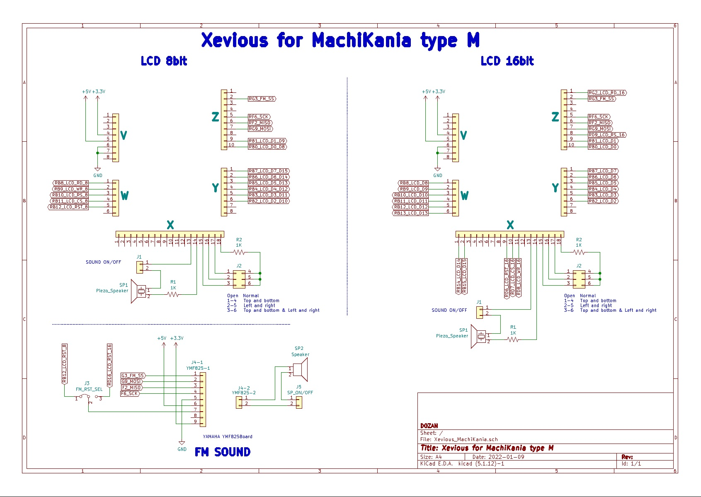

## ソフトの紹介  

　1980年代に一世を風靡したアーケードゲームを　ケンケン様作成の [MachiKania type M](http://www.ze.em-net.ne.jp/~kenken/machikania/typem.html)上で  
　出来る限り再現しましたので 楽しんで頂ければ幸いです。  
　音声は2和音PWM、YAMAHAのFM音源（[YMF825Board](http://uda.la/fm/)) (要3.3V改造)  に対応。  
　尚　16bit版は　LCDのmodeを16bitに変更の上D0~D15の配線と制御線の変更が必要です。  
　<ケンケン様HP>http://www.ze.em-net.ne.jp/~kenken/index.html  　

## 回路図  
  

## 動作環境  

MachiKania type M ・・・ SDカードブートローダ対応  

  検証済みLCD  
　　◆2.4インチ aitedo [M024C9325SLD](https://www.aitendo.com/product/15381 )(ILI9325)  
　　◆2.4インチ aitendo [UL024C0154D8](https://www.aitendo.com/product/16104)(S6D0154)  
　　　※2020/4/4現在　aitendoで発売中のUL024C0154D8は  
　　　　制御チップが異なる物が有り動作しない場合が有ります。  
　　　　動作しない場合　β版のXevious_NEW_UL024C0154D8.hexを  
　　　　お試しください。  
　　◆3.2インチ aitendo [LCD032-2P](https://www.aitendo.com/product/13748)(SSD1289)  
　　　※（Arduino互換のpin配列に変換が必要）  
　　◆2.8インチ aitendo [M028C8347D8](https://www.aitendo.com/product/10942)(HX8347-D)  
　　　※（Arduino互換のpin配列に変換が必要）  
　　◆3.2インチ aitendo [M032C9341B3](https://www.aitendo.com/product/11138)(ILI9341)  
　　　※（Arduino互換のpin配列に変換が必要）  
　　◆2.6インチTFT液晶with基板 aitendo [M-1N3204-2P](https://www.aitendo.com/product/11975)(R61505W)  
　　　※（Arduino互換のpin配列に変換が必要）  
　　◆3.5インチ★液晶モジュール aitendo [M035C9486LB3](https://www.aitendo.com/product/11138)(ILI9486L)   
　　　※（Arduino互換のpin配列に変換が必要）  
　　　従来の液晶の解像度は240ｘ320　本液晶の解像度は  
　　　320ｘ480有るので　縦、横ともに1.5倍に拡大表示を  
　　　しています。  
　　◆2.4インチ aitendo [UL024S8AAA](https://www.aitendo.com/product/13414)(ILI9325)  
　　　　※RD,WR,RS,CS端子が通常と違う配置となっている為  
　　　　ピンアサインの設定を変更してビルドしています。  
　　　　又　RST端子も違う端子に接続されている為  
　　　　ケンケン様のツイッターを参考に変更してください。  
　　　　https://twitter.com/KenKenMkIISR/status/1119941544297897984  
　　◆ELEGOO製 [2.8型液晶シールド](https://www.amazon.co.jp/gp/product/B06Y5ZXXL8)(ILI9341)  
　　◆HiLetgo製 [2.4型液晶シールド](https://www.amazon.co.jp/gp/product/B0722DPHN6)(ILI9341)  
  
## 起動方法
　　1. SDカードにLCDに対応するHEXファイル（実行ファイル）を保存。  
　　　　※ファイル名は8文字以下に変更しコピー願います。  
　　2. MachiKania type MnにてSDカードブートローダ起動し テレビ画面上の  
　　　　リストからHEXファイルを選択しLOADする。  
　　　　※ファイル容量が大きいので黒い画面が15秒程度続きますが  
　　　　　焦らずお待ちください。  
　　3. 一度起動すると次回からは電源を入れると直ぐにゲームが始まります。  
